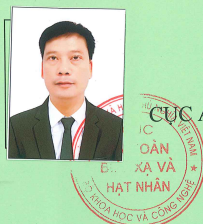
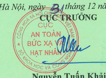

CHUNG CHÍ
NHÂN VIÊN BỨC XA
AN TOÀN BỨC XẠ VÀ HẠT NHẤN
chứng nhận:

| Ông:          | Vũ Văn Hiêu                                           |
|---------------|-------------------------------------------------------|
| Ngày sinh:    | 24/3/1978                                             |
| Số CMND:      | 031030473                                             |
| Cập ngày:     | 12/9/2012                                             |
| Tại:          | Công an TP. Hải Phòng                                 |
| Nơi làm việc: | Công tv TNHH Heesung Electrics Việt Nam               |
| Đia chỉ:      | Lô G1, khu công nghiệp Tràng Duê, xã Lê Lợi, huyện An |

Dương, TP. Hải Phòng Đủ điều kiện đảm nhiệm công việc sau:
NGƯỜI PHỤ TRÁCH AN TOÀN
/2020/NVBX/ATBXHN
này có giá trị đên ngày 31/12/2025.

tháng 12 năm 2020

