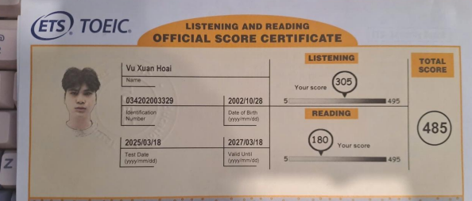

Official Representatives of ETS" IIG Vietnam IIG Education Laos" IIG Education Cambodia" IIG Education Myanmac rved. ETS fogo, and TOEIC are registered frademarks of ETS.

10 - 0 ES) Oppyright © 2022 by ET5. All rights re VN2001 미

Oct 27, 2023 Vu Hoai has successfully completed Foundations of Project Management an online non-credit course authorized by Google and offered through Coursera COURSE

CERTIFICATE
Amanda Brophy Global Director of Google Career Certificate
  
Coursera has confirmed the identity of this individual and
 
P
10 口 ANNEYYYYYXXXXXX

# Certificate Of Accomplishment

SQL (Intermediate)
PRESENTED TO
Vu Xuan Hoai The bearer of this certificate has passed the HackerRank skill certification test Earned on:  28 Mar, 2025 ID: 208B6687549B

NXX
SECTION NY Y Y 18 YO FE

# Certificate Of Accomplishment

SQL (Advanced)
PRESENTED TO
Vu Xuan Hoai The bearer of this certificate has passed the HackerRank skill certification test Earned on:  28 Mar, 2025 ID: 1097F679250B

